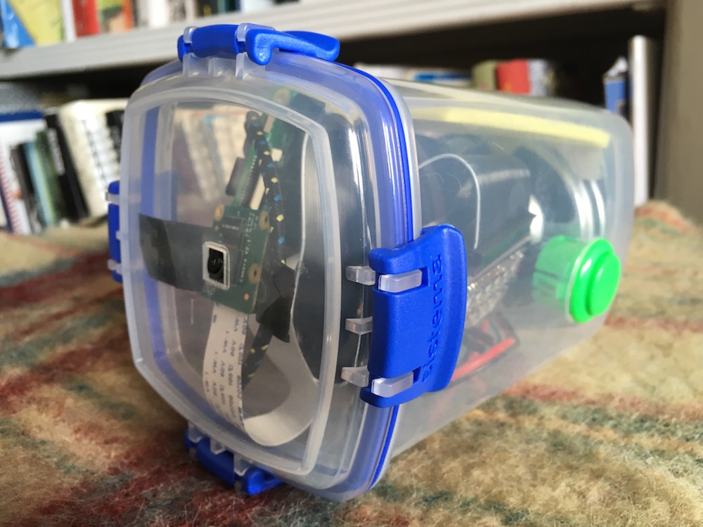

# A speaking box using imagenet and tensorflow



I used a Raspberry Pi 3 with a <a href="https://shop.pimoroni.com/products/phat-beat">Phatbeat</a> and a <a href="https://shop.pimoroni.com/products/mini-black-hat-hack3r?variant=19448025991">black hat hacker</a> (I could have used <a href="https://shop.pimoroni.com/products/adafruit-stacking-header-for-raspberry-pi-2x13-extra-tall">stacking headers</a> on the phatbeat) in order to add a <a href="https://shop.pimoroni.com/?q=mini%20arcade%20buttons">more interesting button</a> as in the image above (you can also just use the built-in buttons on the phatbeat). I also used a <a href="https://sistemaplastics.com/products/klip-it-utility/900ml-cracker">Systema Klip-it 900mm</a> with laser-cut holes for the button and speaker and camera and <a href="https://shop.pimoroni.com/products/3-speaker-4-3w">this speaker</a> which fits exactly in the bottom of the Klip-it. I got an <a href="https://groceries.asda.com/product/phone-accessories/onn-black-3350mah-power-bank/1000042036382">ONN Black 3350MAH Power Bank battery (£4) from Asda</a> which fits in the box at a slight angle and will power it for a few hours.

## Burn an SD card 

I used <a href="https://www.balena.io/etcher/">Etcher</a>.

(Assuming a Mac) Enable ssh

```touch /Volumes/boot/ssh```

## Put a wifi password in

```nano /Volumes/boot/wpa_supplicant.conf```

```
country=GB
ctrl_interface=DIR=/var/run/wpa_supplicant GROUP=netdev
update_config=1

network={
  ssid="foo"
  psk="bar"
}
```

## Put the card in the pi

Eject and put the SD card in the pi. Attach the camera and phatbeat and button if using it.

## Update

```sudo apt-get update```

## Enable camera

```sudo raspi-config``` # and enable camera

## Change the name

in /etc/hosts and /etc/hostname

## Fix the audio

```sudo nano /boot/config.txt```

Disable on-board audio by commenting out dtparam=audio=on:

```
#dtparam=audio=on
dtoverlay=hifiberry-dac
```

reboot

## Test audio

```aplay /usr/share/sounds/alsa/Front_Center.wav```

## Install tensorflow

```
sudo apt install python3-dev python3-pip
sudo apt install libatlas-base-dev -y
```

Give it enough swap to compile numpy

```sudo nano /etc/dphys-swapfile```

contents:
```
CONF_SWAPSIZE=1024
```

### Install virtualenv

```
sudo pip install virtualenv
virtualenv -p python3 env
```

### Install numpy

```
cd env/
source bin/activate
pip3 install numpy
```

(lots of errors but does seem to work: try it again if it doesn't work first time)

```pip3 install tensorflow```

## Test tensorflow

```python3 -c "import tensorflow as tf; tf.enable_eager_execution(); print(tf.reduce_sum(tf.random_normal([1000, 1000])))"```

## Get imagenet

```cd
git clone https://github.com/tensorflow/models.git
cd ~/models/tutorials/image/imagenet
```
and test it

```python3 classify_image.py```

## Install openCV

```pip3 install opencv-python
sudo apt-get install libjasper-dev
sudo apt-get install libqtgui4
sudo apt-get install libqt4-test
```

Test opencv

```python3 -c 'import cv2; print(cv2.__version__)'```

## Install the pieces for talking to the camera

```pip3 install imutils picamera```

...and for speaking

```
sudo apt-get install mplayer
sudo apt-get install libttspico-utils
```

## Test audio file generation

```/usr/bin/pico2wave -w test.wav hello | mplayer test.wav```

## Get the server and client files

scp or clone the following to your device

```
buttons.py
classify_image_client.py
classify_image_server.py
classify-image-client.service
classify-image-server.service
pulseaudio.service
install_pulseaudio.sh
```

## Install dependencies

```pip3 install flask
pip3 install phatbeat
pip3 install requests
```

## Make them run automatically

```
sudo cp classify-image-server.service /lib/systemd/system/classify-image-server.service
sudo systemctl enable classify-image-server.service
sudo systemctl start classify-image-server.service

sudo cp classify-image-client.service /lib/systemd/system/classify-image-client.service
sudo systemctl enable classify-image-client.service
sudo systemctl start classify-image-client.service
```
## Install pulseaudio as a user

```sudo ./install_pulseuadio.sh```


## Restart

```sudo reboot```

Wait a minute or two for it to start. 
Press the playpause button on the phatbeat to get it to capture an image.


